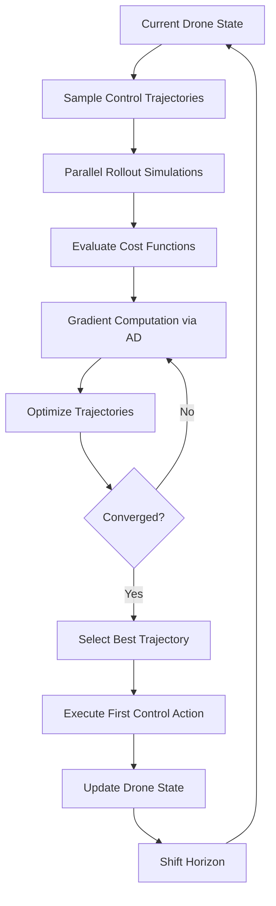
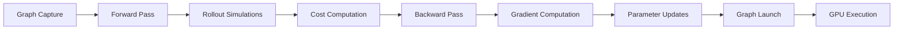
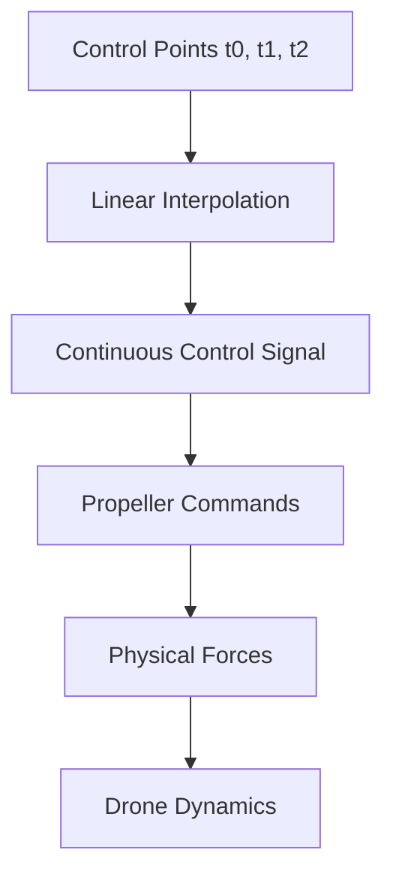
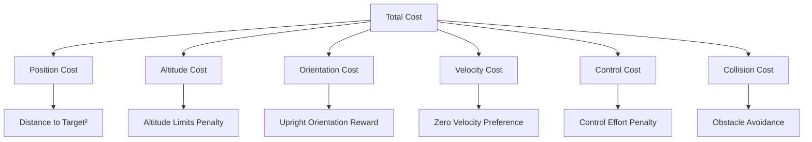
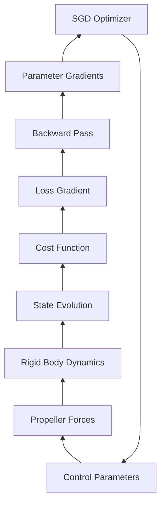
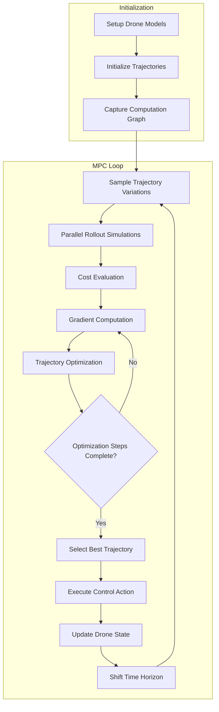

# Differentiable Drone MPC Example Analysis

## Overview
This example demonstrates a sophisticated Model Predictive Control (MPC) system for drone navigation using Newton's differentiable simulation capabilities. The system continuously optimizes control trajectories to navigate between targets while avoiding obstacles, leveraging GPU-accelerated automatic differentiation through Warp's computational graph system.

## Model Predictive Control (MPC) Architecture

### Core MPC Concept
MPC is a control strategy that:
1. **Predicts** future system behavior over a finite horizon
2. **Optimizes** control inputs to minimize a cost function
3. **Executes** only the first control action
4. **Repeats** the process in a receding horizon fashion



## Warp Graph Optimization System

### Graph Capture Mechanism
```python
def capture(self):
    if wp.get_device().is_cuda:
        with wp.ScopedCapture() as capture:
            self.forward_backward()
        self.graph = capture.graph
    else:
        self.graph = None
```

**Key Benefits:**
- **Performance**: Eliminates kernel launch overhead by pre-compiling the entire optimization pipeline
- **Memory Efficiency**: Optimizes memory allocation patterns
- **Parallelism**: Maximizes GPU utilization through optimized scheduling

### Graph Execution Flow


## Differentiable Simulation Pipeline

### 1. Parallel Rollout System
The system maintains multiple parallel simulation worlds:
- **Reference Drone**: Single drone executing the current best trajectory
- **Rollout Drones**: Multiple parallel simulations (default 16) exploring trajectory variations

```python
self.rollouts = Drone(
    "rollout",
    self.fps,
    (self.control_point_data_count, self.control_dim),
    variation_count=self.rollout_count,
    size=drone_size,
    requires_grad=True,  # Enable differentiability
    state_count=self.rollout_step_count * self.sim_substeps,
)
```

### 2. Control Trajectory Representation


**Trajectory Structure:**
- **Control Points**: Discrete waypoints in time (default 3 + 1 for interpolation)
- **Control Dimensions**: 4 propeller thrust commands (0.1 to 1.0 range)
- **Interpolation**: Linear interpolation between control points for smooth control

### 3. Forward Simulation Process

```python
def forward(self):
    # Initialize parallel rollouts from current state
    wp.launch(replicate_states, ...)
    
    # Simulate each rollout forward in time
    for i in range(self.rollout_step_count):
        for _ in range(self.sim_substeps):
            self.update_drone(self.rollouts, self.solver_rollouts)
        
        # Compute costs at each step
        wp.launch(drone_cost, ...)
        wp.launch(collision_cost, ...)
```

**Simulation Steps:**
1. **State Replication**: Copy current drone state to all rollout simulations
2. **Physics Integration**: Step each rollout forward using semi-implicit solver
3. **Cost Evaluation**: Compute position, velocity, control, and collision costs

### 4. Cost Function Design



**Cost Components:**
```python
@wp.kernel
def drone_cost(...):
    pos_cost = wp.length_sq(pos_drone - target)
    altitude_cost = wp.max(pos_drone[2] - 0.75, 0.0) + wp.max(0.25 - pos_drone[2], 0.0)
    upright_cost = 1.0 - wp.dot(drone_up, upvector)
    vel_cost = wp.length_sq(vel_drone)
    control_cost = wp.dot(control, control)
```

## Automatic Differentiation Implementation

### 1. Gradient Flow Architecture


### 2. Tape-Based Automatic Differentiation
```python
def forward_backward(self):
    self.tape = wp.Tape()
    with self.tape:
        self.forward()  # Record all operations
    self.rollout_costs.grad.fill_(1.0)  # Set loss gradients
    self.tape.backward()  # Compute parameter gradients
```

**Key Features:**
- **Operation Recording**: Tape captures all differentiable operations during forward pass
- **Reverse Mode AD**: Backpropagation computes gradients efficiently
- **Memory Optimization**: Gradient computation scales with output dimension, not parameter count

### 3. Gradient-Based Optimization
```python
self.optimizer = warp.optim.SGD(
    [self.rollouts.trajectories.flatten()],
    lr=1e-2,
    nesterov=False,
    momentum=0.0,
)
```

**Optimization Loop:**
1. **Forward Pass**: Simulate all rollouts and compute costs
2. **Backward Pass**: Compute gradients of costs w.r.t. control parameters
3. **Parameter Update**: Apply SGD to reduce costs
4. **Constraint Enforcement**: Clamp control values to valid ranges

## Complete MPC Workflow



### Performance Optimization Strategies

1. **CUDA Graph Capture**: Pre-compiles entire optimization pipeline
2. **Parallel Rollouts**: Simultaneous evaluation of multiple trajectory candidates
3. **Batch Operations**: Vectorized kernel launches for all operations
4. **Memory Reuse**: Efficient state buffer management
5. **Gradient Caching**: Reuses computation graph across iterations

### Trajectory Sampling Strategy

```python
@wp.kernel
def sample_gaussian(mean_trajectory, noise_scale, ...):
    # Sample around current best trajectory
    sample = mean + noise_scale * wp.randn(r)
    # Enforce control constraints
    rollout_trajectories[world_id, point_id, control_id] = wp.clamp(sample, lo, hi)
```

**Exploration Strategy:**
- **Gaussian Sampling**: Add noise around current best trajectory
- **Constraint Handling**: Ensure sampled controls remain within physical limits
- **Adaptive Noise**: Could be adjusted based on convergence behavior

## Technical Advantages

### 1. Differentiable Physics Integration
- **Exact Gradients**: AD provides machine-precision gradients through complex physics
- **Contact Handling**: Smooth gradients even during collision events
- **Solver Integration**: Gradients flow through semi-implicit integrator

### 2. GPU-Accelerated Optimization
- **Parallel Evaluation**: Multiple trajectories optimized simultaneously
- **Graph Optimization**: Eliminates CPU-GPU synchronization overhead
- **Memory Efficiency**: Optimized memory access patterns

### 3. Real-Time Performance
- **Captured Graphs**: Minimize runtime overhead
- **Batch Processing**: Vectorized operations across all rollouts
- **Efficient Solvers**: Fast physics integration with gradient support

## Applications and Extensions

**Current Capabilities:**
- Multi-target navigation with obstacle avoidance
- Real-time trajectory optimization
- Collision-aware path planning

**Potential Extensions:**
- **Multi-Agent Systems**: Coordinate multiple drones
- **Dynamic Obstacles**: Handle moving obstacles
- **Learned Dynamics**: Incorporate neural network models
- **Robust Control**: Handle uncertainty and disturbances

This example showcases the power of combining differentiable simulation with model predictive control, enabling sophisticated autonomous navigation capabilities with real-time performance through advanced GPU acceleration techniques.